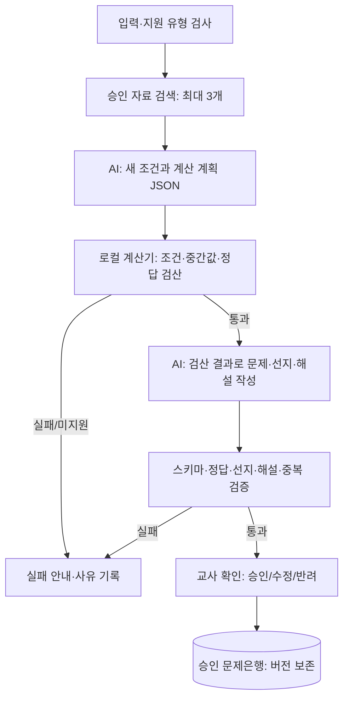

# 화학 AI 시스템 설계

갱신일: 2026-09-19 · 상태: 웹 v27 쌍둥이 문제 첫 MVP·문제/풀이 명시 분리·문제만 입력 시 STEP 풀이 생성·최종 검사 하네스 v1 구현. 단계별 쉬운 문제·RAG·범용 독립 검산은 후속 설계

**현재 웹 MVP는 로컬 Gemma 4 12B와 DeepSeek Flash를 선택하거나 둘 다 비교합니다.** 생성 후 코드 검사, 선택 모델의 별도 텍스트 검토, 로컬 Qwen3-VL의 완성 PNG 대조를 실행합니다. Windows 구조는 [기술 스택](윈도우_기술스택.md)을 따릅니다.

## 핵심 객체: 풀이 로직 카드

생성의 기준 객체는 임의의 문제 본문이 아니라 교사가 확인한 `문제 + 정답 + 해설 + 실제 풀이 단계`다. 단계 수는 문제마다 다르며 모델에 전달하는 공통 계약의 `suppliedSteps`를 다음처럼 사용한다.

| 단계 | 저장 내용 | 생성 결과의 의무 |
|---|---|---|
| 1. 출발 판단·가정 | 첫 판단, 가정, 분기 또는 모순 확인 | 같은 판단을 학생이 직접 해야 함 |
| 2. 핵심 계산·관계 | 식, 비율, 보존 관계, 도형 관계와 순서 | 수치는 달라도 같은 논리 연산을 사용 |
| 3. 결론·검산 | 답 도출과 조건 재대입·유일성 확인 | 답과 해설이 새 조건에서 일치해야 함 |

문제와 풀이 입력은 화면에서 두 칸으로 고정한다. 문제 이미지는 필수이고 풀이 이미지는 선택이다. 한 파일에 문제와 풀이가 함께 있으면 같은 파일을 두 역할로 전달한다. 풀이가 있으면 이미지에 표시된 단계 수와 순서를 보존한다. 풀이가 없으면 문제 본문을 읽은 뒤 `ProblemSolver`가 정답·해설을 만들고 실제 판단·계산 전환에 따라 1~12개 단계로 정리한다. 지원 반응량 유형은 모델 호출 없이 코드로 풀고, 그 밖의 유형은 선택 모델의 구조화 응답을 사용한다. 기준 풀이가 준비된 뒤에만 모든 단계를 같은 순서로 사용하는 쌍둥이 문제 하나를 생성한다. 지원 반응량 코드는 정답과 수치를 검산하지만 사용자가 준 풀이 설명이나 단계로 덮어쓰지 않는다.

단계별 학습 문제는 같은 카드에서 `필수 단계 집합`을 명시해 후속 구현한다. 예를 들어 `{1}`, `{1,2}`, `{3}`을 따로 생성하고, `{3}` 문제에는 STEP 1·2에서 얻을 값을 문제 조건으로 제공한다. 이 기능은 쌍둥이 문제 생성의 교사 승인율과 수치 검산이 안정되기 전에는 생성 버튼에 섞지 않는다.

모델 선택과 풀이 로직 데이터는 분리한다. Gemma와 DeepSeek가 같은 카드·공통 출력 계약·공통 하네스를 사용하고, 모델별로 연결 방식·토큰 한도·JSON 옵션만 다르게 둔다. 승인 카드는 모델 중립적인 RAG·평가 데이터가 된다. Gemma 실행 중 얻은 승인 카드를 DeepSeek 문맥에도 사용할 수 있지만 Gemma의 학습 가중치나 LoRA를 DeepSeek에 옮길 수는 없다.

MVP의 “학습”은 요청 때 카드와 관련 승인 예제를 찾아 넣는 문맥 학습이다. 매 문제마다 파인튜닝하지 않는다. 파인튜닝은 충분한 승인 카드, 반려 사례, 잠근 평가셋이 쌓여 기본 모델 대비 승인율과 오류율이 실제로 좋아질 때 모델별 어댑터로 별도 진행한다.

## 현재 구현: 최종 검사·그림 템플릿 (v23 문제+풀이 MVP)

`ProblemQualityHarness`는 본문·해설·풀이 단계, 보기 5개와 정답 연결, 입력 식별값, 그림 데이터 형식·필수 그림을 검사합니다. 독립 검산은 지원 반응량 유형과 NaOH 가열·증발 무시 농도 유형에 한정합니다. NaOH 기호식은 밀도 5쌍의 수치 대조이며 대수 증명의 보장이 아닙니다. 숫자 밀도는 표시 자릿수에 따른 반올림과 정답 유일성을 검사합니다. 다른 유형은 `unknown`으로 남습니다.

생성 모델을 별도로 한 번 호출해 문장·조건·수치/단위/해설·그림 의미를 검토합니다. 같은 공급자의 별도 호출이므로 독립 수학 증명이 아니며 AI 오판이 가능합니다. 완성 PNG는 외부 공급자에 보내지 않고 로컬 Qwen에 전달합니다. 실제 판독한 보기 5개와 그림 라벨을 코드에서 기대 문자열과 대조합니다. 판독 불일치·응답 형식 오류·연결 실패·시간 초과는 검증 통과로 처리하지 않습니다.

| 상태 | 의미 | 대응 |
|---|---|---|
| pass | 구현된 검사가 통과함 | 교사 검수 전 초안이며 정확성 보증은 아님 |
| unknown | 미지원 검산, 판독 불확실 또는 검사 미완료 | 시간 초과·연결 실패는 같은 결과 재검사. 검산 미지원은 교사 검산 |
| fail | 코드 또는 AI 검토가 오류를 지적함 | 복사·PNG 저장·인쇄 차단. AI 오판 의심은 재검사, 실제 생성 오류는 원본 입력을 유지해 재생성. 원본 조건 부족일 때만 입력 보완 |
| skipped | 선행 오류 때문에 후속 검사를 호출하지 않음 | 추가 오류나 판독 실패가 아님. 선행 오류를 해결한 뒤 검사 |

전체 상태는 fail 우선, 다음 unknown, 모두 통과하면 pass입니다. unknown은 경고를 유지한 초안 출력이 가능하고, fail은 일반 출력 버튼이 차단됩니다. 재검사는 결과를 수정하지 않습니다. 문항 재검사는 선택 공급자의 API를 한 번 더 호출하므로 DeepSeek 비용이 추가됩니다. 자동 수정·자동 승인·무한 재시도는 구현하지 않았습니다. WPF 실행 경로에는 웹 최종 검사 오케스트레이션이 아직 연결되지 않았습니다.

`ScientificTemplates`의 `beaker-sequence`는 모델이 용기명·내용 라벨·액면 비율·이동 문구를 입력하면 코드가 비커 외형·배치·화살표·라벨 줄바꿈을 결정하는 의미 템플릿입니다. 원시 좌표를 모델이 매번 그리는 방식보다 일관된 레이아웃을 사용합니다. 액면 기본값은 개략도이며 실제 부피를 추측하지 않습니다. 기존 점전하·그래프 전용 렌더러는 유지합니다. 기하·회로 등은 아직 일반 그림 요소를 사용하며 모든 그림이 템플릿으로 전환된 것은 아닙니다.

`ReactionVariantPlan`은 원본에서 독립 계산 가능한 A+bB→2C+2D·실험 3개 질량/상대 몰비·몰질량 비 질문만 인식합니다. 원본 질량을 2~5배로 바꾸고 상대 몰비를 유지한 표·정답·보기 순서를 코드로 구성해 모델에 전달하고 최종 수치에도 적용합니다. 원본의 무차원 정답은 유지되는 제한된 변형이며 난이도나 반응 계수를 새로 설계하는 기능은 아닙니다. 모델 문장 초안과 코드 템플릿 재구성 사실을 결과에 표시합니다. 원본 모순·물질량/몰질량 혼동은 검산형 생성 전에 중단합니다. 풀이만 있는 모드·필수 그림이 있는 다른 유형에는 적용하지 않습니다. 웹 v28은 문제/풀이 역할을 입력 칸으로 고정하고, 풀이가 없으면 실제 풀이 단계를 먼저 생성한다. 코드 계획은 생성 수치·정답을 검산하지만 입력 풀이의 단계 수·설명은 바꾸지 않습니다. 미지원 문제를 고정 샘플로 대체하지 않습니다.

이전 하네스 검증은 Core 163개·JavaScript 37개 및 직접 작성한 Gemma 반응량 문항이었습니다. AI PNG 검사에서 긴 표 제목 겹침을 놓친 사례도 있어 표 셀 폭에 맞춘 줄바꿈·행 높이를 코드에서 결정했습니다. 이전 NaOH PNG 판독 불일치는 unknown으로 남았습니다. 증거: `artifacts/evidence/quality-harness/`. 이 이전 검증에서는 사용자 원본을 외부 공급자에 새로 전송하지 않았습니다.

2026-09-19에는 요구사항 PDF의 반응량 문제를 실제 DeepSeek 읽기·생성·문항 검토에 전달했다. 웹 v27에서 문제만 입력, 문제/풀이 별도 입력, 같은 통합 이미지를 두 칸에 입력하는 세 경로가 모두 생성·텍스트 검토·완성 PNG 대조를 통과했다. Core 186개와 JavaScript 47개가 통과했고 외부 HTML·JS도 배포 파일과 일치한다. 같은 원본의 Gemma 전체 성공은 아직 별도 검증 대상이다. 자동 통과가 전체 품질을 보증하지는 않는다.

### 외부 로그인·중계 복구 (v22)

외부 게이트웨이가 살아 있어도 PC와의 SSH 중계가 끊기면 로그인 API가 멈출 수 있습니다. `start-web.ps1`은 SSH 원격 명령으로 `tunnel-guard.py`를 실행합니다. 서버의 가드는 중계 포트 18282의 미인증 API가 401을 반환하는지 검사하고, 연속 3회 실패하면 소유자·직접 부모·명령 세션을 다시 확인한 뒤 자기 SSH 부모만 종료해 남은 포트를 해제합니다. 전역 SSH 설정과 다른 서비스는 변경하지 않습니다.

로그인은 자동 반복 요청 없이 15초의 독립 시간 제한을 적용합니다. 요청 취소가 응답을 끝내지 못하는 경우에도 대기를 종료하며, 뒤늦게 도착한 이전 인증 응답은 새 로그인 상태를 바꾸지 않습니다. 연결 실패와 비밀번호 오류를 구분합니다. JavaScript 44개와 가드 정책 5개 테스트를 실행했으며, 별도 임시 포트 18284에서도 실제 세션 자동 종료·포트 해제를 검사합니다. 외부 검사는 비밀번호를 전송하지 않은 공개 파일·401 응답 확인이며, 실제 비밀번호 인증은 로컬에서 확인합니다.

아래 RAG·계획/작성 분리·문제은행 승인·평가셋 설계는 이후 구현 목표입니다. 현재 구현 여부는 위 절을 기준으로 봅니다.

## 1. 처음 완성할 AI의 범위

반응량·한계 반응물 중 독립 계산 가능한 좁은 유형 하나를 선택합니다. 기준 문제·풀이 단계·고정 조건·변경 조건을 받아 새 문제 하나와 선지·정답·해설을 만듭니다. 지원하지 않는 유형이나 정보가 부족한 입력은 생성 전에 안내합니다.

현재 생성은 기존 로컬 llama-server에 HTTP로 요청합니다. 계산은 로컬 코드, 자료 검색은 로컬 DB로 추가할 목표입니다. 처음부터 학습·파인튜닝·새 GPU 서버를 구축하지 않습니다. 맞춤 숙제는 최근 오답 태그에 맞는 승인 문제를 고르는 규칙으로 시작하고, OMR은 OpenCV와 사람 확인으로 처리합니다. 학생 이름·연락처·답안 원본은 문제 생성 API에 보내지 않습니다.

## 2. 현재 로컬 모델과 이후 비교

- 실행 모델: `gemma-4-12b-it-qat-q4_0.gguf`, GGUF 내부 `gemma4 / 12B`와 서버 모델 목록을 확인했습니다.
- 기존 경로: `D:/work/dev/blog/windows/.models/gemma-4-12b-it-qat-q4_0.gguf`.
- 서버: 기존 `llama-server.exe`로 전용 `http://127.0.0.1:8092/v1/`를 실행하며 컨텍스트는 8,192토큰입니다. 기존 공유 8089 서버는 재시작하거나 설정을 바꾸지 않습니다. 서버·모델은 EduMaster 설치판에 포함하지 않습니다.
- 기존 공유 Gemma 서버는 `vision=false`로 유지하고 EduMaster 생성용 전용 Gemma는 projector를 로드하여 `vision=true`로 실행합니다. 생성에는 원본 PNG/JPG와 본문을 직접 함께 보냅니다. 이미지 읽기·대조는 별도 로컬 Qwen3-VL 4B 서버(`127.0.0.1:8091`)에서 처리하며 PDF는 Windows API로 페이지를 렌더링해 전달합니다. 기존 Windows OCR·Gemma 이미지 인식에서 저해상도 글자 오독을 재현했습니다. 기본 예시는 PDF에서 추출한 반응량·분자 구조 원본입니다. 재조판 표·별도 제작 그래프는 테스트 자료로 분리했으며 그 테스트 통과는 원본 인식 품질의 증거가 아닙니다. 저해상도 원본에는 오독이 남아 본문 확인이 필요합니다.
- 생성 버튼은 `LocalGemmaGenerator`의 모델 확인 → `chat/completions` → JSON 스키마·원문·보기 검사를 호출합니다. 로컬 주소만 허용하고 HTTP 리디렉션은 따라가지 않습니다. 기존 Gemini 키는 읽거나 전송하지 않습니다.
- 계산한 `answerText`와 동일한 보기가 정확히 하나일 때 앱이 정답 번호를 결정합니다. 이는 정답 번호의 연결 검사이며 정답 계산 자체를 검증하는 기능은 아닙니다.
- 서버 중단·다른 모델·잘린 응답·원문 복제·정답/보기 불일치는 실패로 표시합니다. 자동 유료 대체와 자동 재시도는 없습니다. 사용자가 다시 생성할 수 있습니다.

향후 공급자 계약은 계획·작성 단계를 분리하고 공급자별 어댑터에서 인증·구조화 출력·옵션·사용량을 처리합니다. Gemini·DeepSeek를 비교할 때는 동일한 기준셋의 치명 오류·승인율·검수 시간·승인 문제당 총비용을 측정합니다. 특정 모델이 로컬보다 정확하거나 저렴하다는 결론은 실측 뒤 내립니다. 파일 인식은 [공식 Qwen3-VL 4B GGUF](https://huggingface.co/Qwen/Qwen3-VL-4B-Instruct-GGUF)의 Q4_K_M 모델과 Q8 projector를 로컬에 설치했습니다. 모델 약 2.5GB와 projector 약 454MB이며 기존 Gemma 가중치와 별도로 실행합니다.

구현 근거: [llama.cpp 서버 API](https://github.com/ggml-org/llama.cpp/blob/master/tools/server/README.md), [멀티모달 설정](https://github.com/ggml-org/llama.cpp/blob/master/docs/multimodal.md), [Gemma 4 12B GGUF](https://huggingface.co/google/gemma-4-12B-it-qat-q4_0-gguf).

## 3. 한 문제를 만드는 처리 순서



| 데이터 | 필수 내용 | 담당 |
|---|---|---|
| GenerationRequest | 기준 문제 버전, 유형, 단계, 고정/변경 조건 | 앱 입력 검사 |
| GenerationPlan | 반응식·계수·몰질량·단위·새 입력값·계산 대상 | AI 계획 + 스키마 검사 |
| VerifiedCalculation | 정확한 중간값·정답·단위·검증 근거 | 로컬 계산기 |
| CandidateProblem | 본문·선지·정답·해설·참고 자료 ID | AI 작성 |
| ValidationResult | 규칙별 통과/실패/미지원과 사유 | 로컬 검증기 |

계획의 원자 수·양수 조건·물질량·한계 반응물·단위를 검사하고 C# BigInteger 기반 유리수 계산으로 답을 구합니다. 계산기는 유형별로 개발자가 작성한 코드만 실행합니다. 모델이 제시한 정답·도구 결과·실행 코드를 그대로 믿지 않습니다. 반응식이 실제로 해당 조건에서 성립하는지 등 코드로 보장하지 못하는 화학 판단은 지원 규칙과 교사 검토 범위를 명시합니다.

작성 후에는 정답 선지 하나, 선지 중복, 숫자·단위·해설 일치와 원문 단순 복제를 확인합니다. 자동 통과는 지원 범위의 검사를 통과했다는 뜻이며 전체 화학 품질의 보증은 아닙니다. 승인 전에는 학습지에 넣지 않고 수정본은 새 버전으로 다시 계산·검증합니다.

정상 요청은 계획·작성의 **AI 호출 2회**로 시작합니다. 잘못된 JSON이나 수정 가능한 작성 오류는 검증 사유로 최대 1회 보완합니다. 조건 오류는 작성만 고쳐 통과시키지 않고 새 계획이 필요하다고 안내합니다. 한 작업의 보완과 공급자 대체 호출은 합쳐 최대 1회로 제한합니다. 무한 재시도·자동 반복 생성은 하지 않습니다. [Gemini 구조화 출력](https://ai.google.dev/gemini-api/docs/structured-output)을 사용해도 내용의 정확성 검사는 별도로 필요합니다.

## 4. RAG: 검수한 자료를 찾아 참고시키기

RAG는 모델을 재학습하는 기능이 아니라 **지금 요청에 맞는 승인 문제·풀이 규칙을 찾아 함께 보내는 방식**입니다. 초반에는 기준 자료 3개를 파일에서 직접 선택하고, 03 단계에서 SQLite 문제은행과 FTS5 검색으로 연결합니다. 벡터 DB 서버를 처음부터 운영하지 않습니다.

### 무엇을 저장하나

| 자료 | 저장 단위 | 관리 항목 |
|---|---|---|
| 승인 기준 문제 | 문제·정답·해설을 연결한 한 묶음 | 문제 ID/버전, 유형, 풀이 단계, 난이도 |
| 개념·생성 규칙 | 조건과 예외를 함께 담은 한 규칙 | 출처, 적용 유형, 검수자, 규칙 버전 |
| 긴 풀이 참고 자료 | 의미가 이어지는 단락 | 원문 위치, 연결 문제 ID, 내용 해시 |

처음의 짧은 문제는 통째로 사용합니다. 긴 자료는 약 300~600토큰을 시작 기준으로 나누되 반응식·표·수치와 그 조건을 분리하지 않습니다. 각 조각에 출처·사용 권한·승인 상태·유효 버전을 연결합니다. 입력 PDF를 자동으로 전부 신뢰 자료로 등록하지 않습니다. 반려 사례는 별도 실패 예제 저장소에 두어 올바른 풀이 자료와 섞이지 않게 합니다.

### MVP 검색 순서

유형·풀이 단계·개념·변경 조건으로 검색어를 만들고 승인·현재 유효 버전으로 먼저 제한합니다. FTS5 후보 최대 10개에서 같은 원문 계열을 중복 제거한 뒤 최대 3개, 합계 약 2,000토큰의 참고 자료를 사용합니다. 교사가 지정한 기준 문제와 필수 규칙은 유지하고 나머지 참고 자료를 예산에 맞춰 줄입니다.

한국어는 NFC 정규화와 검수한 동의어 목록을 사용합니다. 예를 들어 한계 반응물과 제한 반응물을 연결합니다. 화학 기호의 대소문자·첨자·수치는 보존합니다. FTS5 trigram을 사용하되 3글자 미만 검색은 태그·정확 일치 조회로 보완합니다. FTS5 자체를 한국어 의미 검색으로 간주하지 않습니다. [SQLite FTS5 안내](https://www.sqlite.org/fts5.html)

관련 자료가 없으면 무관한 문제를 채워 넣지 않습니다. 지정 기준 문제와 승인 규칙만으로 처리 가능한지 검사하고, 부족하면 자료 추가를 요청합니다. 검색 결과는 신뢰 명령이 아닌 참고 데이터로 넣으며 문서 속 지시문이 시스템 정책을 바꾸지 못하게 합니다. UI에는 사용한 자료와 버전을 보여 줍니다.

### 의미 검색은 언제 붙이나

키워드 검색의 누락이 평가에서 확인되면 임베딩을 추가합니다. 첫 후보는 텍스트 모델 `gemini-embedding-001`, 768차원입니다. 문서는 `RETRIEVAL_DOCUMENT`, 질의는 `RETRIEVAL_QUERY`로 생성하고 768차원 벡터는 직접 L2 정규화합니다. 모델·차원·정규화 방식이 같은 벡터만 비교합니다. [Google 임베딩 안내](https://ai.google.dev/gemini-api/docs/embeddings)

초기에는 SQLite에 벡터와 원문 ID·내용 해시·인덱스 버전을 저장하고 C# 로컬 코사인 검색으로 시작할 수 있습니다. 약 5,000조각 이내를 가정해 실제 속도를 측정한 뒤 규모가 커지면 전용 인덱스를 검토합니다. FTS와 벡터 검색을 합칠 때는 서로 다른 점수를 직접 더하지 않고 순위 기반 RRF로 합칩니다. 추가 LLM 재정렬은 후속입니다.

원문·FTS 갱신은 같은 트랜잭션으로 처리합니다. 임베딩은 대기/완료/실패 상태로 별도 생성하며 실패해도 키워드 검색은 유지합니다. 폐기 자료는 즉시 검색 자격에서 제외하고 AI 전송 직전에 다시 검사합니다. 임베딩 모델 변경은 새 인덱스를 따로 완성한 뒤 전환하며 기존 공간과 섞지 않습니다. 생성 모델을 DeepSeek로 바꾸는 것만으로 임베딩을 다시 만들 필요는 없습니다.

## 5. 프롬프트를 정리하는 방법

프롬프트를 화면 코드에 긴 문자열로 흩어 놓지 않습니다. 선행 MVP의 파일 변형 프롬프트는 `src/EduMaster.Core/Prompts/file-variant-v1.txt` 공통 규칙과 `local-variant-v2.txt` 로컬 규칙(응답 버전 v2.1), `image-reader-v1.txt` 전사 규칙으로 분리해 앱 리소스에 포함했습니다. 아래는 앞으로 만들 소스 구조이며 현재 파일이 생성된 상태는 아닙니다.

```text
prompts/
  manifest.json          버전·파일 해시·평가 결과 연결
  system.md              역할·지원 범위·자료 취급·금지 규칙
  types/stoichiometry.md  첫 유형의 조건·표현·선지 작성 규칙
  tasks/plan.md           새 조건·구조화된 계획 작성
  tasks/write.md          독립 검산 결과로 본문·해설 작성
  tasks/repair.md         검증 실패 항목만 제한적으로 보완
src/EduMaster.Core/AI/    C# 공통 계약·스키마·명시적 검증의 기준
evals/                   기준 입력·정답·실패 사례·평가 보고서
```

프롬프트 입력은 시스템 정책, 유형 규칙, 작업 지시, 사용자 조건, RAG 참고 자료, 검산 결과를 구분합니다. 참고 자료에 포함된 명령은 실행하지 않으며 빠진 정보는 임의로 채우지 않게 합니다. 해설에는 학생이 확인할 계산 단계와 근거를 요구하고 모델 내부 사고 과정의 제공을 전제로 하지 않습니다.

로컬 Gemma용·외부 API용 정책을 각각 복제하지 않습니다. 공통 규칙을 유지하고 어댑터에서 출력 형식과 지원 옵션을 변환합니다. 온도·thinking·출력 한도는 실제 API가 지원하는 값으로 모델별 설정에 고정하고 평가합니다.

변경은 **오류 사례 추가 → 규칙/프롬프트 수정 → 같은 기준셋 평가 → 결과 비교 → 새 버전 적용** 순서로 처리합니다. manifest에 프롬프트·스키마 해시와 통과 보고서를 연결하고 이전 버전으로 되돌릴 수 있게 합니다. 프롬프트 예제로 평가용 정답을 가져오지 않습니다.

## 6. 하네스: 바뀔 때마다 품질을 다시 확인하기

하네스는 고정된 입력을 넣고 계산 정확도·검색·AI 결과·비용을 같은 방식으로 비교하는 평가 도구입니다. **가짜 응답으로 확인하는 자동 회귀 테스트와 실제 API 품질 평가를 구분**합니다. 가짜 응답 테스트의 성공을 모델 품질로 보고하지 않습니다.

| 묶음 | 확인할 것 | 방법 |
|---|---|---|
| 계산 | 경계 물질량, 한계 반응물, 유리수, 단위, 반응 계수 | xUnit의 기대 중간값·정답 비교 |
| 계약·실패 | 깨진 JSON, 정보 누락, 복수 정답, 시간 초과, 예산, 중복 클릭 | xUnit과 고정 어댑터 응답 |
| 검색 | 정답 참고 자료 Recall@3, 무관 자료, 폐기 버전, 자료 없는 질의 | 고정 질의·관련 자료 ID 비교 |
| 생성 | 계산 일치, 선지, 해설, 표현, 단순 복제, 교사 승인 | 실제 API + 규칙 검사 + 교사 검수 |
| 공격·격리 | 참고 자료 속 지시문, 임의 코드, 승인 우회, 학생 정보 전송 | 실패 사례의 차단 결과 확인 |
| 전체 흐름 | 수정 재검증, 학습지 정답표, 답 정정과 재추천 | 저장·화면·출력 통합 확인 |

10월 16일까지 20~30개 기준 문제를 준비합니다. 예를 들어 24개를 개발용 16개와 잠근 평가용 8개로 나누고, 같은 원문과 숫자만 바꾼 변형은 같은 묶음에 넣습니다. 잠근 평가 문제와 해설은 RAG·프롬프트 예제에서 제외합니다. 초기 3개 참고 문제는 개발용에 속합니다. 경계·실패 사례는 별도 테스트로 더합니다.

실제 모델 비교는 같은 평가 입력·참고 자료·호출 예산을 사용하고 잠근 문제마다 최소 3회 생성합니다. 문장이 완전히 같아야 한다고 검사하지 않고 계산·선지·규칙·교사 평가를 비교합니다. 제공되지 않는 seed로 재현성을 보장하지 않습니다. 작은 기준셋 통과는 전체 유형의 정확도 보증이 아니며 실제 배포 전 지원 범위에서 생성 후보 최소 100개를 추가 검수하는 목표를 둡니다.

모델·프롬프트·스키마·계산 규칙·검색 인덱스가 바뀌면 해당 회귀 테스트와 실제 생성 평가를 수행합니다. 교사는 가능하면 모델 이름을 가린 후보를 검수합니다. 다른 AI의 점수는 보조 신호로만 사용하고 정답과 승인 여부를 단독 결정하게 하지 않습니다.

### 초기 통과 목표 — 실측 후 담당자가 확정

| 지표 | 제안 기준 |
|---|---|
| 지원 범위의 기준 계산 | 기대 정답·중간값 100% 일치 |
| 치명 오류·승인 우회 사례 | 준비한 사례 모두 차단, 평가 중 승인본의 치명 정답 오류 0건 |
| 첫 응답 스키마 통과율 | 95% 이상, 보완 전/후 따로 집계 |
| 교사 승인율 | 70% 이상, 저가 전환 시 기준 모델 대비 하락 5%p 이내 |
| 검색 Recall@3 | 관련 자료가 있는 고정 질의에서 90% 이상 |
| 저가 전환의 실제 비용 | 승인 문제 1개당 총 API 비용 30% 이상 절감 |
| 작업 대기 | API 1회 최대 60초, 보완 포함 작업 최대 180초로 시작해 실측 조정 |

모든 지표에 분모·실패 수·실행 환경을 기록합니다. 기준을 못 넘으면 이전 설정을 유지합니다. 정확도 부족을 낮은 토큰 가격으로 상쇄하지 않습니다. 치명 정답 오류가 발견되면 해당 설정의 신규 승인을 중지하고 영향 문제·학습지를 확인한 뒤 수정·재평가합니다.

## 7. 비용과 품질을 비교하는 기준

현재 로컬 호출에는 토큰당 API 과금이 없습니다. GPU·전력·생성 대기·검수 시간은 별도 비용이며 승인 문제당 총비용으로 비교합니다. 외부 모델은 도입 시 공식 가격과 사용 가능한 모델 ID를 확인합니다. 기존 설계의 가격 예시는 현재 기본 실행 비용으로 사용하지 않습니다.

핵심 지표는 총 운영비용 ÷ 교사가 승인한 문제 수입니다. 승인 수가 0이면 계산 불가로 표시합니다. 후보 1개·앱 동시 작업 1개로 시작하고 출력 4,096토큰·응답 300초 한도를 적용합니다. 긴 자료는 생성할 한 문제만 남깁니다. 모델이 잘못된 계산을 쓸 수 있으므로 좁은 유형의 독립 계산기를 다음 우선 작업으로 둡니다.

유료 공급자를 추가하면 예상 최대 비용·실제 사용량·보완 횟수·일/월 예산을 관리합니다. 기본 공급자를 사용자 허용 없이 자동 전환하지 않습니다.

## 8. 작업 기록과 운영

작업마다 입력 스냅샷, 요청/응답 모델 정보, 프롬프트·스키마·계산기 버전, 검색 자료 ID·버전·내용 스냅샷, 인덱스 버전, 검증 결과, 교사 결정, 토큰·비용·단계별 시간·재시도 사유를 저장합니다. API 키와 불필요한 개인정보는 기록하지 않습니다. 이전 작업은 현재 자료로 다시 검색하지 않고 당시 자료를 기준으로 원인을 분석할 수 있게 합니다.

타임아웃·인증·호출 제한·공급자 장애·미지원·검증 실패를 다른 오류로 표시합니다. 중단한 작업은 이전 입력을 유지하고 재실행 비용을 안내합니다. 승인 문제는 실패한 새 후보로 덮어쓰지 않습니다. paid API의 데이터 이용 조건과 보존 정책을 운영 전에 확인하고, 초기 개발은 예시 자료와 비식별 문제만 사용합니다.

## 9. 2개월 구현 순서와 후속 확장

| 시점 | 꼭 완성할 AI 단위 |
|---|---|
| 10/05~10/08 | Gemma 연결 보완·3개 승인 참고 자료·계획/작성 프롬프트·독립 계산·단일 후보 |
| 10/12~10/16 | 20~30개 기준셋·잠근 평가 분리·실패 차단·교사 평가·버전 기록 |
| 10/19~10/23 | SQLite/FTS5 RAG·출처/승인/버전 관리·검색 평가 |
| 10/26~11/06 | 승인본을 PDF·정답표·수동 채점에 연결해 교사용 MVP 확인 |
| 11/09~11/20 | 오답 태그 기반 숙제·OMR 사람 검수 연결 |
| 11/23~11/30 | 통합 평가·비용/복구 확인, 여유가 있으면 DeepSeek 작성 단계 비교 |

**11월 MVP는 로컬 Gemma 한 공급자로 끝낼 수 있습니다.** DeepSeek 기본 전환·벡터 검색·LLM 재정렬·파인튜닝은 평가 근거가 생긴 뒤 추가합니다. 후속 순서는 저가 작성 모델 비교 → 통과 시 작성 전환 → 계획 모델 비교 → 검색 누락이 확인되면 임베딩 도입입니다. 새 모델 도입을 위해 기존 2개월 기능 목표를 계속 늘리지 않습니다.

기능별 체크리스트는 [02 실제 AI 생성](02_실제_AI_생성.md), 전체 날짜와 상태는 [개발 일정](../일정/개발일정.md)에 기록합니다. 현재는 파일 입력·로컬 Qwen 이미지 읽기·Gemma 생성·반응량 한 유형의 검산·초안 표시를 선행 구현했습니다. 반응량 표 `A + bB → 2C + 2D`는 소비 질량비·공통 상대값 배율·b·x·몰질량비를 코드로 계산하고 새 표·보기·해설에 적용합니다. 일반 화학 유형의 독립 검산·교사 승인·RAG·전체 기준셋 품질 평가는 미구현입니다.

## 현재 실행판과 목표 설계의 차이 · 2026-09-17

현재는 파일/본문 → 로컬 인식 및 사용자 수정 → 모델 1회 호출 → 원문·필드·보기 검사 → AI 초안 표시입니다. 목표의 계획/독립 계산/작성·RAG·교사 승인 단계는 아직 없습니다. 실제 테스트용 탄산칼슘 10 g 문제를 20 g/0.2 mol, 25 g/0.25 mol로 변형했고 계산과 보기 연결을 수동 확인했습니다. 사진과 원본 5페이지 PDF의 로컬 OCR도 확인했습니다. 이는 화학 품질 기준셋 통과를 뜻하지 않습니다.

자동 테스트 44/44, WPF 회귀 15/15, 실제 로컬 호출·OCR 확인 4/4. `artifacts/evidence/local-gemma/`와 `artifacts/evidence/local-ui/`는 별도 테스트 데이터로만 생성합니다. 사용자 workspace나 API 키를 테스트 자료에 복사하지 않습니다.


## 원본 시각 정보 전달과 직접 생성 (0.5.0)

기존에는 OCR 결과 문자열만 생성에 보냈으므로 그래프·분자 연결을 잃을 수 있었다. 현재 경로는 원본 렌더링 PNG와 확인된 본문 → Qwen3-VL 시각 정보 → 원본 이미지도 직접 받는 Gemma 문항 작성 → Qwen3-VL 원본 대조다. 0.4.0의 간접 텍스트 전달에서 0.5.0의 직접 image_url 전달로 변경했다. 생성 전 Gemma 모델과 실제 서버 `modalities.vision`을 확인한다.

`VisualUnderstanding`은 종류, 요약, 고유 id의 노드, 양끝 id 및 관계를 가진 연결, 시각 조건, 불확실성 배열이다. 그래프·분자·도식은 노드·연결·조건이 모두 있어야 한다. 없는 노드로 연결하거나 불확실성이 남은 응답은 거부한다. 표/본문은 이미 전사된 자료를 사용하고 시각 분석에서 몰수 등 추가 해석을 만들지 않는다. 이미지 분석과 대조 프롬프트는 `visual-understanding-v1`, `visual-verify-v1`, 생성 프롬프트 버전은 `local-variant-v3`다.

출력의 그림은 원본 시각 자료를 보존한 것이다. 첫 단계는 그림 관계 및 내부 표기를 변경하지 않는 문항 변형만 허용한다. 새로운 곡선·분자/도식을 생성하는 기능은 추후 명시적인 좌표·결합 모델, 렌더러 및 별도 검증을 갖춘 후 추가한다. 원본 대조도 모델의 오판 가능성이 있으므로 교사 확인 전 AI 초안 상태를 유지한다. 좁은 반응량 표는 코드가 원본과 새 표의 모든 질량 2배 및 상대 몰비 유지 여부까지 확인한다.

웹의 렌더링 이미지는 비공개 서버 메모리에서 최대 10건·건당 10MB, 약 2시간 보관한다. 업로드 디스크는 요청 종료 시 삭제하고 메모리는 만료 시 정리한다. 재시작/만료된 식별자는 400 오류이며 텍스트만으로 자동 전환하지 않는다. 브라우저의 초기화/텍스트 예시는 이미지 연결을 명시적으로 해제한다. Windows는 앱이 이미 보존하는 원본 첨부를 다시 읽으므로 업로드 캐시가 필요 없다.


Gemma 전용 실행기는 `scripts/start-gemma-vision.ps1`, 공식 projector 설치기는 `scripts/install-gemma-vision.py`다. projector는 BF16 175,115,616 bytes이며 다운로드 시 공식 lfs SHA256도 확인한다. 기존 QAT q4_0 12B 본체는 재사용한다. 이미지 token 수는 1120으로 고정하고 batch/ubatch 모두 2048로 설정한다. 비인과 이미지 prefill에 필요한 ubatch 크기와 CPU/GPU 공존을 실제 실행에서 확인했다. Gemma 직접 이미지 입력 표시는 `ImageInputCount`, 발견한 모델 alias는 `RuntimeModelId`에 기록한다. 기존 8089 주소의 Windows 설정은 읽을 때 새 기본 주소로 연결하고 사용자 설정 파일은 덮어쓰지 않는다. Qwen은 생성 전 분석과 생성 후 대조를 유지하므로 서로 다른 모델의 시각 판단을 비교한다. 독립적인 교사 승인이라는 뜻은 아니다.

## 공통 구성과 모델별 구성

문항 결과 계약과 파싱 검증, 코드 수치 검산, 반응량 계산 계획 및 비커 그림 템플릿, PNG 렌더러와 로컬 Qwen 최종 이미지 검사는 공통이다. 핵심 그림/템플릿 프롬프트도 공통 상수를 사용한다. 생성 본문 프롬프트는 Gemma의 VariantResponse.LocalPrompt와 DeepSeek 생성기의 별도 시스템 문구로 나뉘어 있으며 아직 모든 생성 규칙이 한 파일로 통합된 것은 아니다. 연결/인증/모델 이름/토큰 한도/JSON 출력 옵션은 공급자별이다. 텍스트 검토 기준은 공통 프롬프트를 사용하지만 실제 검토는 선택한 모델을 별도로 한 번 호출한다. 같은 검사 기준이 같은 판정 정확도를 보장하지 않는다.

현재 학습 데이터 저장소·파인튜닝·RAG는 구현하지 않았다. 향후 검수 원천 데이터와 평가 문제는 공통으로 관리하고, 학습 입력 형식과 가중치/어댑터는 모델별로 분리한다. Gemma의 학습된 어댑터를 DeepSeek에 그대로 적용할 수는 없다.
