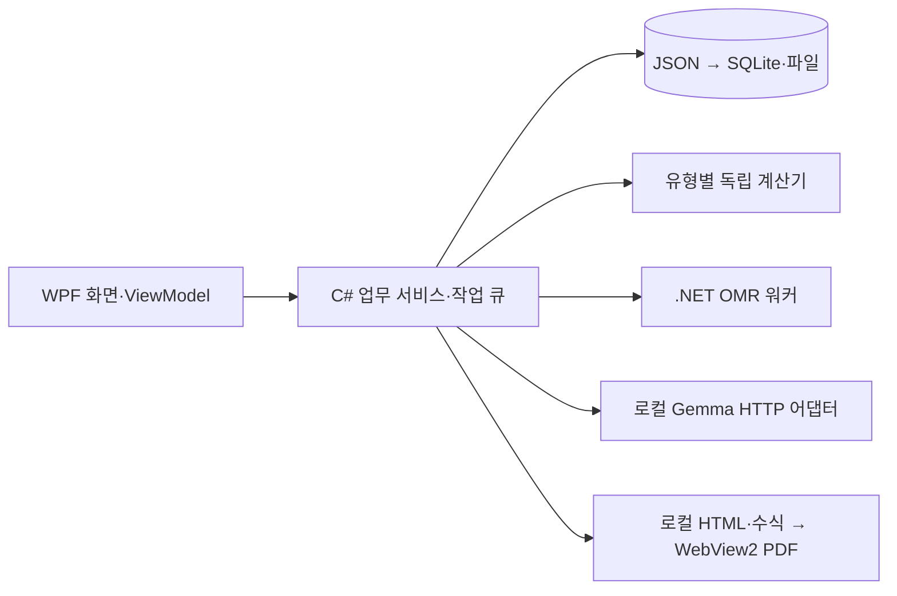

# Windows 프로그램 기술 스택 조사와 추천

조사일: 2026-09-16~17 · 상태: WPF 첫 샘플 UI 구현·설치 확인, 비교 성능·실사용 검증 전 · 대상: Windows 11 x64

**우선 추천은 C#·.NET 10 + WPF입니다.** 문제 관리·채점 화면은 WPF로 만들고, 수식 미리보기와 학습지 PDF에 WebView2를 제한적으로 사용합니다. 기존 Electron 확정안을 이 비교·추천안으로 대체합니다. 실제 개발에서는 첫 작은 시연으로 설치·표시·출력을 확인한 뒤 구성을 고정합니다.

## 1. 비교 기준과 결론

Windows 전용 설치 프로그램, 개발자 1명의 2개월 MVP, 문제·학생·답안의 로컬 저장, 한글·화학식·수식·A4 학습지, 고정 답안지 OMR, 외부 AI API가 기준입니다. 재사용할 앱 코드는 현재 없습니다. 개발자의 C#/React 숙련도 차이는 확인되지 않았습니다.

C#은 언어, .NET은 개발·실행 플랫폼이므로 화면 프레임워크까지 포함해 비교합니다. 아래 적합성은 요구사항에 대한 설계 판단이며 동일 앱의 실측 성능 순위가 아닙니다.

| 기준 | Electron + React | C# + WPF | C# + WinUI 3 |
|---|---|---|---|
| 문제 목록·입력·채점표 | React 컴포넌트로 구성 | 기본 DataGrid·입력·바인딩 활용 | XAML·바인딩·필요한 컨트롤로 구성 |
| 수식·HTML 학습지 | 웹 화면과 PDF 출력 연결에 편리 | WebView2로 구현 가능 | WebView2로 구현 가능 |
| Windows 로컬 업무 | Electron main/IPC로 연결 | .NET 서비스와 WPF 화면 연결 | .NET 서비스와 App SDK 연결 |
| 배포 구성 | Chromium·Node·네이티브 의존성 | .NET·WebView2·영상 DLL | .NET·App SDK·WebView2·영상 DLL |
| 웹·다른 OS 확장 | 강점 | WPF UI는 Windows 전용 | WinUI 3 UI는 Windows 전용 |
| 이번 프로젝트 판단 | 웹 화면 재사용이 중요하면 유력 | **업무 화면 중심 MVP의 우선 추천** | 최신 Windows UI·App SDK 기능이 중요하면 유력 |

Electron은 Chromium·Node를 포함합니다. WPF는 DataGrid·RichTextBox·파일/인쇄 대화상자·문서·데이터 바인딩을 제공합니다. 이 특성을 이번 요구사항에 적용한 판단입니다. [Electron 소개](https://www.electronjs.org/docs/latest/), [WPF 기능 안내](https://learn.microsoft.com/en-us/dotnet/desktop/wpf/overview/)

## 2. WPF를 우선 추천하는 이유

**현재 기능 대부분이 Windows 로컬 업무 화면입니다.** 문제 목록·검색·승인·학생별 답 입력·채점표를 WPF 컨트롤과 MVVM으로 구성하고, 저장·파일·AI 작업은 .NET 서비스로 분리할 수 있습니다. 현재 다른 OS 출시 요구가 없으므로 Electron의 여러 OS 지원은 선택을 좌우하는 이점이 아닙니다.

**HTML 출력 때문에 Electron이 필수는 아닙니다.** WPF 안의 WebView2에서도 로컬 HTML을 표시하고 PDF로 출력할 수 있습니다. 다만 HTML/CSS 쪽 나눔과 수식 렌더링 구현은 어느 방식에서도 필요합니다. [WebView2 출력 기능](https://learn.microsoft.com/en-us/microsoft-edge/webview2/how-to/print)

**AI 품질은 앱 프레임워크와 별개입니다.** Google은 .NET용 Google.GenAI SDK를 제공하고 DeepSeek는 HTTP API로 연결할 수 있습니다. RAG·프롬프트·검증·하네스도 .NET에서 구현할 수 있습니다. [Google 공식 .NET SDK](https://github.com/googleapis/dotnet-genai), [DeepSeek API](https://api-docs.deepseek.com/)

**업무 코드의 중심을 C#에 모을 수 있습니다.** 독립 계산은 C# 유리수 코드로, OMR은 OpenCvSharp로 구성하는 안을 추천합니다. Python이 필수는 아닙니다. OpenCvSharp는 OpenCV 본체와 별도인 .NET 래퍼이므로 Windows 네이티브 DLL·버전·필요 모듈의 호환성을 확인해야 합니다. [OpenCvSharp 설치](https://shimat.github.io/opencvsharp/articles/getting-started/installation.html)

## 3. WinUI 3과 Electron을 선택할 조건

**Microsoft가 새 네이티브 Windows 앱에 공식 추천하는 것은 WinUI 3 + Windows App SDK입니다.** WPF가 최신 기본 추천이라고 설명하면 부정확합니다. [Windows 개발 경로](https://learn.microsoft.com/en-us/windows/apps/get-started/)

이번에는 최신 Windows 외형과 App SDK 기능보다 입력·표·검토·출력을 2개월 안에 완성하는 것을 우선했습니다. WPF에 필요한 기본 기능이 있고 현재 요구사항에 App SDK 필수 기능도 없어 WPF를 우선 추천합니다. WinUI 3이 불안정하거나 구현할 수 없다는 주장은 아닙니다. 팀의 WinUI 경험이 충분하거나 최신 Windows UI가 핵심 요구라면 추천이 바뀔 수 있습니다.

WinUI 3도 MSIX와 일반 설치판 배포가 가능하며 App SDK 런타임 설치 또는 self-contained 포함을 함께 결정합니다. [WinUI 배포](https://learn.microsoft.com/en-us/windows/apps/package-and-deploy/unpackage-winui-app)

기존 React 편집기를 재사용하거나 웹 서비스와 화면을 공유해야 하는 경우, 다른 OS 출시가 가까운 경우, React 숙련도가 C#/XAML보다 훨씬 높은 경우에는 Electron이 더 실용적일 수 있습니다. 정교한 웹 편집기가 핵심이 되면 WPF와 WebView2 사이의 연결 개발량도 비교해야 합니다. 현재는 이런 조건이 확인되지 않았으므로 React가 항상 더 빠르다는 가정으로 확정하지 않습니다.

## 4. 추천 기술 구성

| 영역 | 추천 구성 | 역할 |
|---|---|---|
| 플랫폼 | C# + .NET 10 LTS | Windows 앱·업무 로직·비동기 작업 |
| 화면 | WPF + CommunityToolkit.Mvvm | 입력·목록·검토·채점, 화면/업무 분리 |
| 저장 | 01은 JSON, 03부터 Microsoft.Data.Sqlite | 승인·학습지·답안 버전과 트랜잭션 |
| 검색 | SQLite FTS5 + 유형/태그 필터 | 승인 자료 검색·로컬 RAG |
| AI | C# HttpClient → 기존 로컬 llama-server / Gemma 4 12B | 키 없는 생성·모델 확인·구조화 출력 |
| 파일 인식 | Windows.Media.Ocr + Windows.Data.Pdf | 사진·PDF 로컬 읽기, 본문 확인/수정 |
| 검증 | System.Text.Json + 명시적 필드/업무 검사 | 타입·필수값·단위·선지·출처 검증 |
| 독립 계산 | C# BigInteger 기반 유리수 계산기 | 유형별 반응량·중간값·정답 |
| OMR | OpenCvSharp + 별도 .NET 워커 | 영상 판독·오류 격리·사람 확인 |
| 수식·PDF | 로컬 HTML/CSS + KaTeX + WebView2 | 미리보기·A4 PDF, 폰트·수식 자산 포함 |
| AI 설정 | 로컬 서버 주소 JSON | 현재 공급자는 API 키 불필요 |
| 설치 | win-x64 self-contained 폴더 + Inno Setup | 런타임·자산·워커·DLL 배포 |
| 테스트 | xUnit + 고정 평가 데이터 | 계산·저장·검색·응답 회귀, 실제 모델 평가 |

.NET 10은 현재 LTS이며 2028년 11월까지 지원되는 계열입니다. MVP 종료 무렵 지원이 끝나는 .NET 8/9 대신 .NET 10을 기준으로 하고 개발 시작 시 지원 패치를 다시 확인합니다. [공식 지원 정책](https://dotnet.microsoft.com/en-us/platform/support/policy/dotnet-core)

구성 근거: [Microsoft MVVM Toolkit](https://learn.microsoft.com/en-us/dotnet/communitytoolkit/mvvm/), [Microsoft.Data.Sqlite](https://learn.microsoft.com/en-us/dotnet/standard/data/sqlite/), [KaTeX](https://katex.org/docs/api), [Inno Setup](https://jrsoftware.org/isinfo.php). 정확한 버전은 첫 설치판 호환성을 확인해 고정합니다. FTS5와 필요한 영상·QR 모듈이 실제 배포 라이브러리에서 사용 가능한지도 검사합니다. JSON 역직렬화와 C# 타입만으로 AI 출력의 의미·정확성이 검증된 것으로 처리하지 않습니다.

QuestPDF는 C# PDF 생성 대안입니다. 수식 렌더링·별도 레이아웃 작업과 Community 라이선스의 사용자·기관·매출 자격 조건을 확인해야 합니다. 우선은 로컬 HTML을 미리보기·출력에 함께 쓰는 WebView2를 검증합니다. [QuestPDF 라이선스](https://www.questpdf.com/license/community.html)

## 5. 실행 구조와 보호

업무 서비스가 승인·예산·버전·저장을 검사합니다. 기존 명세서의 웹 API는 업무 계약 참고이며 이번에는 앱 내부 서비스로 연결합니다. 앱 업무 기능은 내부 서비스로 연결하고 AI는 기존 로컬 llama-server에 요청합니다. 모델 서버는 별도 실행 중이어야 하며 설치판에 포함하지 않습니다. 공유·다기관 서비스는 인증·서버 DB·키 프록시를 추가 설계합니다.

WebView2에는 표시할 비식별 문제 데이터만 전달합니다. 키·DB·임의 파일 접근을 노출하지 않고 외부 탐색·팝업·다운로드와 불필요한 host object·웹 메시지를 차단합니다. 필요한 메시지는 출처·작업·입력을 검사합니다. AI가 쓴 HTML을 실행하지 않고 앱의 고정 템플릿에 정제된 내용으로 넣습니다. [WebView2 보안](https://learn.microsoft.com/en-us/microsoft-edge/webview2/concepts/security)

API는 비동기로 호출하고 무거운 작업은 UI 스레드 밖에서 처리합니다. 작업 ID·단계·경과 시간·취소·실패를 표시합니다. OMR 워커는 고정 실행 파일을 UseShellExecute=false, CreateNoWindow=true로 실행하고 구조화된 허용 요청만 받습니다. AI 작성 코드·명령을 실행하지 않으며 DB 쓰기는 앱 저장 계층 한 곳으로 모읍니다. 종료·시간 초과 시 워커를 정리하고 중단 작업을 자동 유료 재호출하지 않습니다.

데이터는 %LocalAppData%/EduMaster에 저장하고 승인본·학습지 정답표·답안을 버전으로 연결합니다. 백업 API 또는 쓰기 중지 절차로 일관된 DB와 파일 목록을 얻어 별도 위치에서 복구합니다. JSON 이동·업데이트 전 백업과 건수·내용·연결 비교를 수행합니다.

현재 로컬 AI는 키를 사용하지 않습니다. 기존 Gemini 키 파일은 그대로 보존하며 읽지 않습니다. 외부 API를 다시 추가할 때는 DPAPI CurrentUser로 키를 보호하고 번들·로그에서 제외합니다. DPAPI를 전체 DB 암호화로 간주하지 않습니다. [DPAPI 안내](https://learn.microsoft.com/en-us/dotnet/standard/security/how-to-use-data-protection)

## 6. 용량·메모리는 실측이 필요하다

WPF 기본 화면은 앱 전체를 Chromium으로 표시할 필요가 없다는 구조적 이점이 있습니다. 하지만 WebView2도 브라우저 프로세스를 사용하고 .NET 런타임·OpenCV DLL도 포함됩니다. **C#이면 무조건 작은 설치 파일·낮은 메모리라고 보장하지 않습니다.** Electron도 실제 병목을 측정해야 합니다. [Electron 성능 안내](https://www.electronjs.org/docs/latest/tutorial/performance)

self-contained 배포는 .NET 사전 설치를 없애지만 용량을 늘리고 런타임 패치는 앱 업데이트로 반영해야 합니다. WPF는 현재 trimming이 지원되지 않으므로 임의로 잘라 작은 EXE를 만들거나 Native AOT를 기본안으로 약속하지 않습니다. 하나의 설치 파일과 의존성 없는 단일 실행 파일도 구분합니다. [배포 방식](https://learn.microsoft.com/en-us/dotnet/core/deploying/), [WPF trimming 제한](https://learn.microsoft.com/en-us/dotnet/core/deploying/trimming/incompatibilities)

WebView2 Evergreen 런타임은 설치 여부를 검사해 누락 시 설치판에서 함께 설치합니다. 오프라인 설치판에는 Standalone Installer를 포함합니다. Fixed Version은 앱에서 보안 업데이트를 관리해야 하고 공식 문서상 바이너리만 250MB 이상이므로 기본안으로 삼지 않습니다. [WebView2 배포](https://learn.microsoft.com/en-us/microsoft-edge/webview2/concepts/distribution)

| 아직 확인할 항목 | 측정 방식 |
|---|---|
| 시작·메모리 | 동일 자료의 Release 설치판, 최초/재실행 시간과 전체 프로세스 메모리 |
| 용량 | 앱 자체·기존 런타임 활용판·오프라인 의존성 포함판 구분 |
| 표시·PDF | 한글·화학식·수식·표·쪽 나눔, 모든 페이지와 실제 A4 출력 |
| 규모·응답 | 같은 문제 목록·필터·채점표에서 지연과 UI 멈춤 확인 |
| 설치·복구 | 개발 도구 없는 Windows PC, 실행·업데이트·오프라인 사용·복원 |

## 7. 2개월 MVP에 적용

10월 1~2일에 WPF 입력·JSON 저장·재시작·설치판과 기준 문제의 WebView2 표시/PDF를 작게 확인합니다. 출력 위험을 초반에 확인하는 작업이며 정식 학습지는 기존 04 단계에서 완성합니다. 중요한 막힘이 있으면 원인을 기록하고 Electron 대안의 같은 기능을 비교해 구성을 고정합니다. 전 기능을 두 방식으로 개발하지 않습니다.

이후 날짜는 유지합니다. 10월 5~16일 AI·C# 계산·하네스, 19~23일 SQLite/RAG, 26일~11월 6일 PDF·수동 채점, 11월 9~20일 맞춤 숙제·OMR, 23~30일 통합·설치·복구를 진행합니다. 코드 서명·인증서 비용은 배포 전에 정하고 초기 내부 설치판의 서명 여부와 Windows 경고를 확인합니다. 자동 업데이트·다른 OS·ARM64는 후속입니다.

기능·날짜는 [단계별 안내](README.md)와 [개발 일정](../일정/개발일정.md), 모델·RAG·프롬프트·평가는 [AI 시스템 설계](AI_시스템_설계.md)를 따릅니다. 09/17에 WPF 첫 샘플 UI·JSON 저장·WebView2 PDF·실행판/설치판을 구현했습니다. 첫 단계는 빠른 시연용 code-behind를 사용하고 화면·업무 서비스를 확대할 때 MVVM을 적용합니다. 파일 입력·로컬 Gemma 연결·로컬 이미지 인식도 선행 구현하고 실제 호출을 확인했습니다. 앱 타깃은 Windows 10 19041 이상으로 설정합니다. SQLite·독립 계산·OMR·코드 서명·상용 설치 도구 라이선스·실사용 성능은 미검증 또는 미완료입니다.

현재 생성 기본 주소는 이미지 지원 Gemma 전용 서버 `http://127.0.0.1:8092/v1/`이다. 기존 Blog용 공유 텍스트 서버 8089는 유지한다. 사진·PDF 원본 PNG를 Gemma 생성 요청에 직접 첨부하며, Qwen 8091은 인식과 대조에 사용한다. 실행 도구는 두 전용 서버를 시작하고 Windows의 이전 기본 8089 설정은 파일을 덮어쓰지 않고 읽을 때 새 주소로 연결한다.
